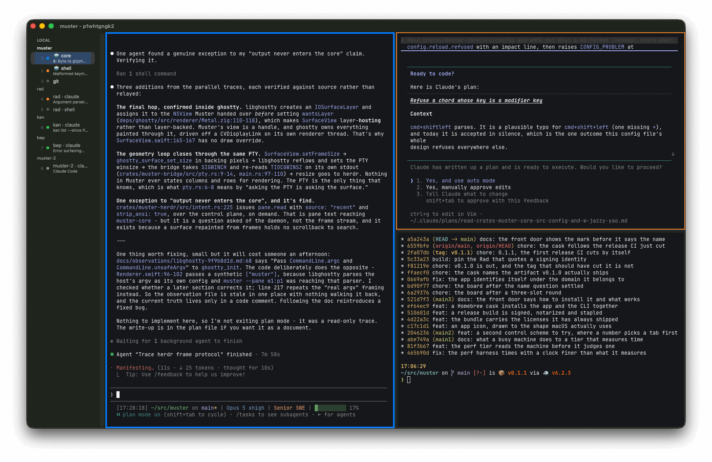
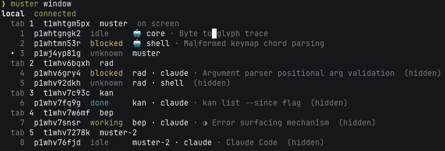

<p align="center">
  
</p>
<h1 align="center">Muster</h1>
<p align="center">
  A macOS terminal for running several AI coding agents at once,<br>
  where every pane tells you what its agent is doing.
</p>

<p align="center">
  
</p>

    brew install amterp/tap/muster

Apple Silicon, macOS 14 or newer. One command brings the app and the `muster` command, because they
are one artifact - the CLI is a file inside the bundle, built from the same commit and carrying the
same signature.

## What it is

Split a window into panes, put a coding agent in each, and read the whole lot at a glance. Every
agent's state - working, waiting on you, done, idle - sits on its row in the agent list down the
side, and a pane whose agent wants noticing carries it on its own edge too. Fifteen agents is
something you read rather than something you click through.

It is a real terminal underneath: every pane is a
[libghostty](https://github.com/ghostty-org/ghostty) surface, the same engine Ghostty renders with,
and the keybindings are the platform's own - `cmd+d` splits, `cmd+t` opens a tab, `cmd+f` searches.
No prefix key, so nothing you type has to get past Muster before the agent sees it.

Your agents do not live in the app. A session daemon owns the terminals, so quitting Muster, closing
the lid or dropping the VPN costs you nothing: the agents keep working and every pane comes back.
When you are finished for the day and want them to stop too, the app menu has a second way out that
says what it would end before it ends it.

## What you get

**A number on every agent.** `cmd+1` to `cmd+9` reach the first nine rows of the list, counting past
every tab and every machine, so an agent is one keystroke away whether or not a split is showing it.

**A notification when an agent needs you, and one click back to it.** An agent that starts waiting
on you, or that finishes while nobody is looking, says so - and activating the notification takes
you to that pane, including one no split is showing. A pane you are already looking at stays quiet;
that is what its border is for. Both are switchable, and one line in your config mutes the lot.

**Names you write, and titles you don't.** Name a pane and the name sticks, emoji and all, because
the daemon writes it down rather than the app. An agent that sets a terminal title gets a second
line under that, so a row reads `payments spike` over `chasing a flaky test`. Drag one row onto
another and the two panes trade places; drop it on a row in a different tab and the agent moves
there.

**More than one window, and `cmd+n` to make one.** Each is its own process, so quitting one leaves
the others alone, and each has its own address for the CLI - `muster window list` says which are
open. A window you ask for opens on tabs of its own: names are shared, so an agent named in one is
the same agent, named the same way, in the other, but only one window at a time can *show* a given
pane.

**Local and remote in one window.** Name an SSH host in your config and its agents appear in the
same list as the ones on your laptop. `cmd+1` and `cmd+2` switch between a laptop tab and a devenv
tab the way tabs switch everywhere else, and one tab can hold both at once - drag a devenv agent's
row onto a laptop tab's caption and they sit side by side. You install nothing over there: Muster
copies across the session daemon it was tested against, checked against a pinned checksum.

**A CLI that drives the window.** `muster` reports what every agent is doing, reads back what any
pane has printed, makes panes and tabs, moves and resizes them, names them, types into them, moves
the keyboard and zooms. Every pane Muster opens can reach it, and it talks to the window that pane
is drawn in - the address is in the pane's environment, so nothing has to be told which window it
belongs to.

    muster window
    muster pane new --down --run claude --name "🤖 reviewer"
    muster pane send --pane p1w3r07bsd "read AGENTS.md and wait" --enter
    muster pane read --pane p1w3r07bsd
    muster pane move --pane p1w3r0ab2n --onto p1w3r07bsd

<p align="center">
  
</p>

So an agent told "split two panes below you and start an agent in each" can do it, and read back
what happened. `muster docs` is the reference, and it ships inside the binary.

## Configuring

One file, `~/.muster/config.toml`, every line of it optional:

```toml
option_as_alt = "left"         # so opt+t reaches an agent instead of typing †

[notifications]
done = false                   # tell me about agents waiting on me, not ones that finished

[keymap]
split_right = "cmd+d"          # the default; Ghostty's, wherever Ghostty has one
close_pane = ""                # unbound - the action stays, the shortcut goes

[font]
family = "Fira Code"
size = 13
```

Saving is enough: colours, fonts and the keymap reach panes that are already open. A file that will
not parse changes nothing and says why at the foot of the agent list, naming the value and what to
write instead. `docs/configuration.md` is every key.

## What is not built yet

Muster is young, and these are the gaps worth knowing about before you install rather than
after:

- Mouse buttons and motion do not reach a pane.
- A pane on an SSH machine cannot drive the window it is drawn in.
- Find reaches only as far back as the session daemon will hand over, which is a thousand rows -
  and a pane running a full-screen program keeps no history behind its screen at all, which is
  most agent panes. The bar says which of those you are looking at rather than leaving a count of
  zero to speak for itself.
- Only the last window you closed comes back. Every window keeps its own arrangement, so
  `cmd+n`'s twin - Reopen Closed Window - brings one back; nothing lists the older ones or names
  which is which.
- Two windows cannot show the same pane. The session daemon allows one client per terminal, so a
  window you open starts on tabs of its own rather than onto what another one is drawing.
- A name you give a pane reaches another window the next time that window asks the daemon what it
  holds, rather than at the moment you type it. Muster's own names are the same in every window.

Muster is not a multiplexer, an agent framework, or a workflow: it gives you panes, states, sessions
and a scriptable surface, and has no opinion about how you run your agents. `AGENTS.md` is the
project's own account of itself, and what to read before contributing.
